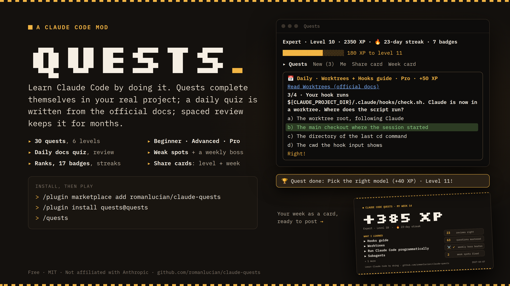
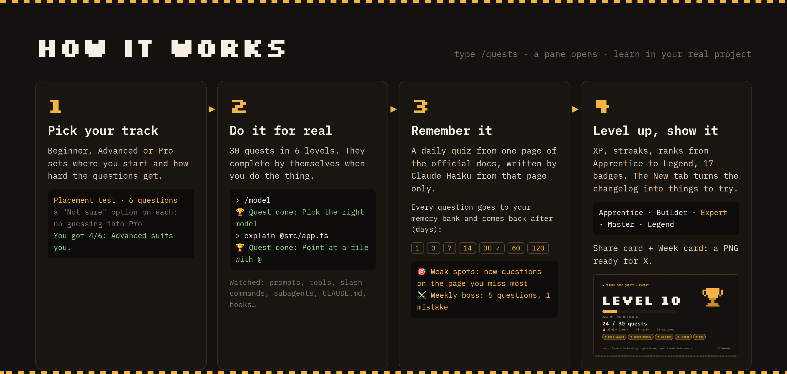
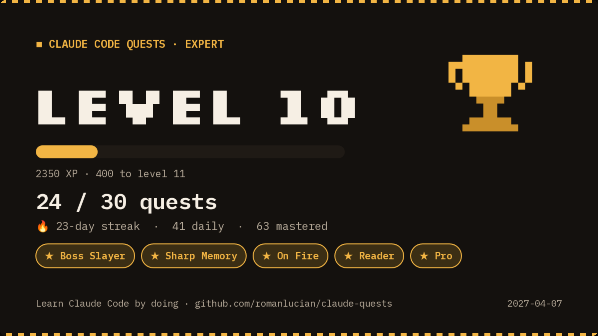
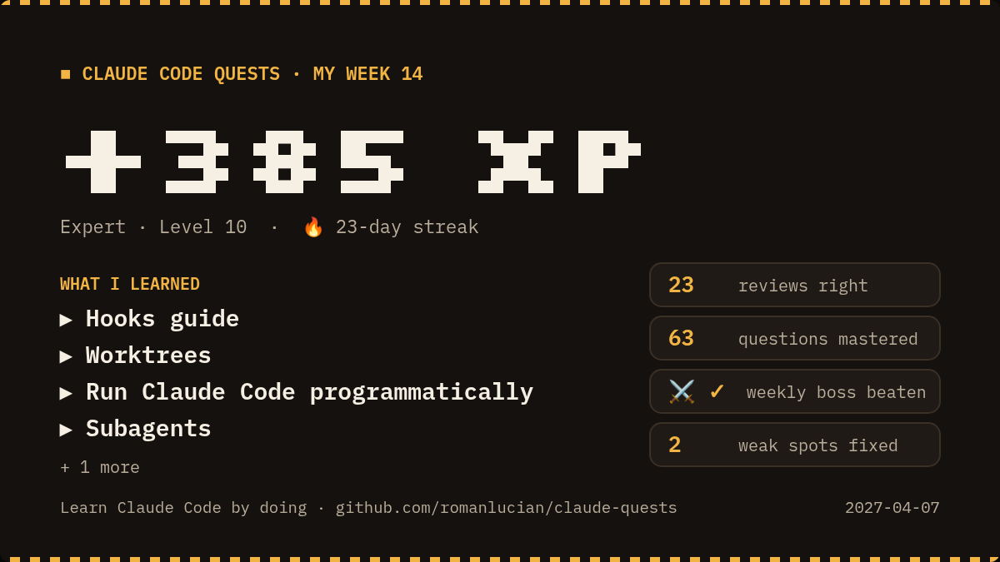

# quests — learn Claude Code by doing

A Claude Code mod that turns learning Claude Code into a game. Type `/quests`
and a pane opens with short missions. You don't read a tutorial: you do the
thing in your real project, and the quest completes by itself.



## Install

In Claude Code:

```
/plugin marketplace add romanlucian/claude-quests
/plugin install quests@quests
```

Then type `/quests`.

## What's inside

**🐱 Your quest guide**: a drawn cat in the corner of the pane. He greets you
with what's waiting (today's page, reviews due, your next quest), cheers when
you earn XP and tells you when an answer was wrong. He moves: he breathes,
his mouth moves while he talks, and he jumps with stars when you level up.
He is small (as tall as the text beside him) and full body: in VS Code (and
any terminal without pictures) a hand-drawn 12×12 pixel sprite in the
terminal's own characters; in Ghostty and kitty the full drawing.
Don't want him? *Me → Cat: on (hide him)*.



**Pick your track**: Beginner, Advanced or Pro. It sets where you start, which
docs pages your daily quest comes from, and how hard the questions are
(Pro: real scenarios, limits and edge cases, 4 options). Change it any time.
Not sure? A **6-question placement test** suggests one (with a "Not sure"
option, so nobody guesses their way into Pro).

**30 quests in 6 levels**, each linked to its page in the
[official docs](https://code.claude.com/docs):

| Level | Quests |
| --- | --- |
| First steps (10 XP) | Ask about your project · Point at a file with @ · Let Claude explore · Let Claude change a file · Let Claude run a command |
| Getting faster (20 XP) | Plan mode · CLAUDE.md memory · Keep the context fresh · Undo with rewind · Look something up on the web |
| Pro moves (30 XP) | Subagents · Skills · MCP · Hooks · Permissions |
| Power user (40 XP) | /context · /model · /resume · /branch · /usage |
| Expert (50 XP) | Your own subagent · your own skill · a shared .mcp.json · /statusline · /plugin |
| Master (60 XP) | Worktrees · /background · claude -p in scripts · /security-review · /loop and /schedule |

Most quests **complete automatically**: the mod watches your session (the
prompt you send, the tools Claude uses, the slash commands you run, a
subagent starting, files like `CLAUDE.md`, `.claude/agents`, `.mcp.json`, and
hooks, allow rules or a status line in your settings). A few have a short
quiz instead, one question at a time. Every quest also has "I did it".

**📅 A daily docs quest**: each day, one page of the official docs from your
track that you haven't done (about 95 learning pages). When you press
*Start*, Claude Haiku reads the page and writes questions from it, with only
facts from that page, at your track's level; answers are shuffled. +25,
+35 or +50 XP. On the **Pro** track, a page you studied before joins
today's, and some questions need both: how two features work together
(for example, where a hook runs once Claude is inside a worktree).

**🔁 Your memory bank: spaced review**. Every daily question is saved. A
question you get right comes back after 3, 7, 14, 30, 60 and 120 days; a
miss comes back tomorrow. Up to 5 reviews a day, +5 XP each. At the 30-day
step a question counts as *mastered*. This is what makes it still worth
opening after six months: you keep what you learned.

**🎯 Weak spots**: a page you missed 2 questions on or more becomes a weak
spot. *Practise it* asks Claude Haiku for **new** questions on that page
(never the ones you already have). At most one miss and the weak spot is
fixed. Once a day, +20 XP.

**⚔️ A weekly boss**: once your bank has questions from 3 pages, every week
brings a boss: 5 questions from different pages, one mistake allowed. Lose,
and try again the next day. +100 XP.

**🔥 Streaks, levels and ranks**: every day with XP keeps your streak going.
Levels get longer as you go (level 2 in a day, level 20 in months), with a
rank: Apprentice, Builder (5), Expert (10), Master (20), Legend (35).

**17 badges**, from your first day to half a year: one per level, Scholar,
Early Adopter, Reader (5 daily) and Bookworm (50), On Fire (7-day streak)
and Unstoppable (30), Sharp Memory (10 mastered) and Elephant (100), Boss
Slayer and Boss Hunter (10 bosses), Comeback (3 weak spots fixed). The **Me** tab shows each one's progress.

**⭐ New**: features from the official
[changelog](https://github.com/anthropics/claude-code/blob/main/CHANGELOG.md),
read once or twice a day, keeping the features a user can try (not the lines
for mod, SDK or admin work). **Explain** asks Claude Haiku to explain one in
plain words; **I tried it** gives +15 XP.

**Share card**: the *Share card* button (or `/quests card`) opens your card,
with your rank, level, streak and badges; *Download PNG* saves it for X.
The **Week card** (or `/quests week`) shows your week: XP gained, the pages
you studied, reviews, weak spots fixed and the boss.

| Level card | Week card |
| --- | --- |
|  |  |

## Good to know

- Progress is kept on your computer (the mod's own store), across sessions.
- Only two things use your Claude usage, and only when you press them:
  *Explain* (one small Haiku call per line, kept so it never asks twice) and
  *Start today's quiz* (one Haiku call a day that reads one docs page, two
  on Pro) and *Practise it* (at most one a day).
  Reviews and the weekly boss reuse your saved questions: no Claude calls.
- The mod reads only public pages: the changelog on GitHub and the docs at
  code.claude.com. Nothing about you is sent anywhere.
- Claude Code changes fast. The quests are short and link the docs, which
  are always the source of truth.
- The cat moves only while the pane is open (a frame swap every 160 ms);
  closed, his clock stops.

## How it works

- `hooks/quests.ts` — the course: quests, quizzes, badges, levels, and
  reading new features from the changelog. Plain data, tested on its own.
- `hooks/register.tsx` — the mod: the `/quests` command, the hooks that
  watch the session, the pane.
- `hooks/card.ts` — the shareable cards (level and week), drawn on a canvas.
- `hooks/cat-pixels.ts` — the pixel cat as terminal cells, made by
  `node scripts/cat-pixels.mjs` from the sprite in `scripts/cat-sprite.mjs`.

Run the tests with `claude plugin test`.

## License

Code: MIT © 2026 Lucian Roman. The cat drawing (`assets/cat/`, `scripts/cat-sprite.mjs`,
and in `docs/`) is Lucian Roman's artwork, all rights reserved: it is not covered by
the MIT license. Not affiliated with Anthropic.
